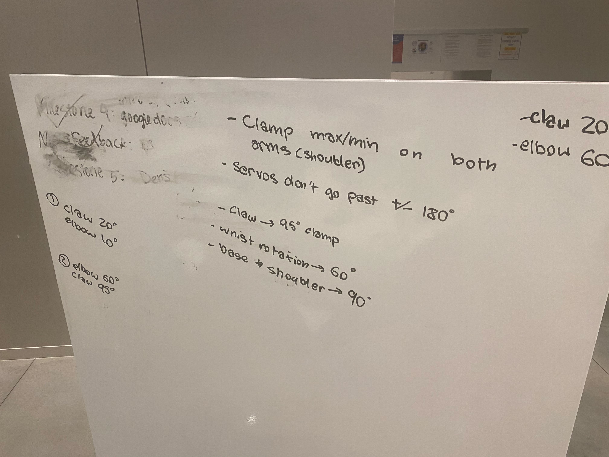
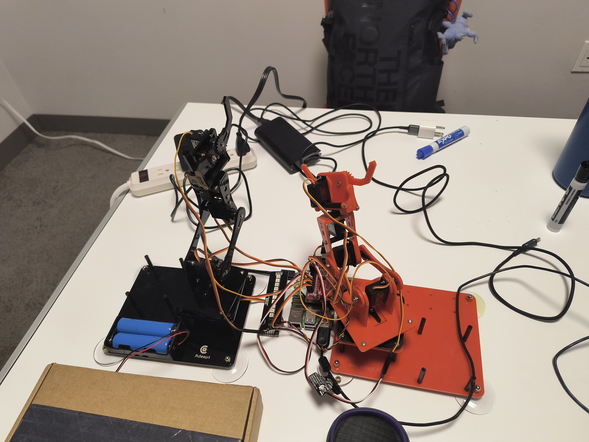
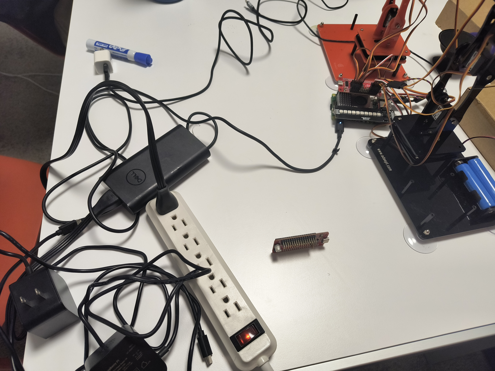
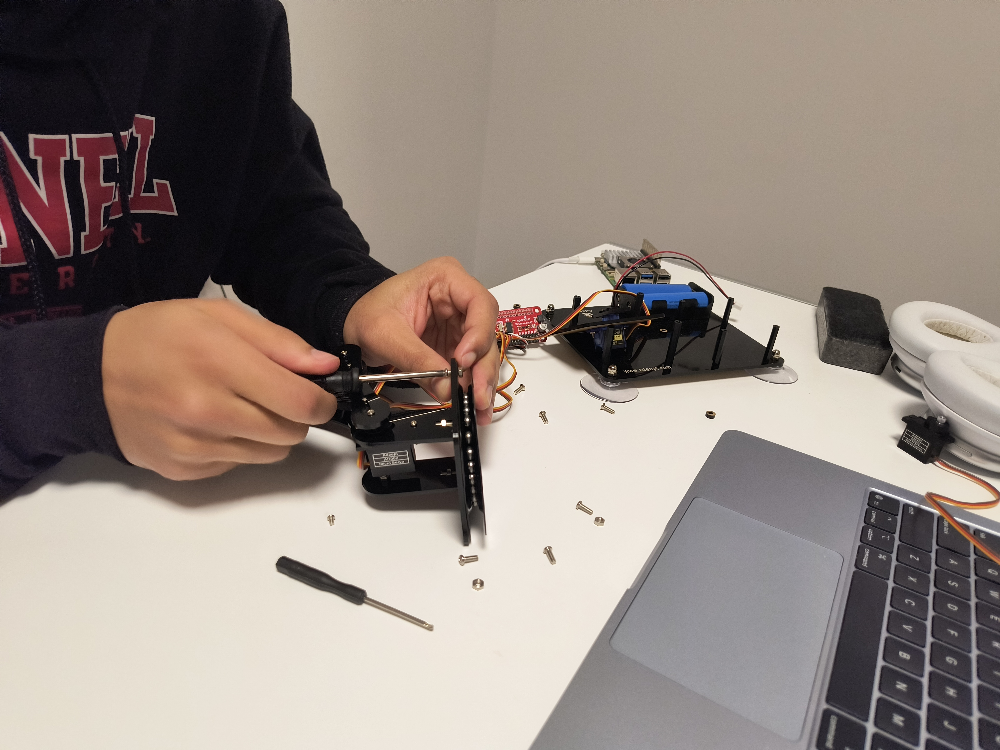
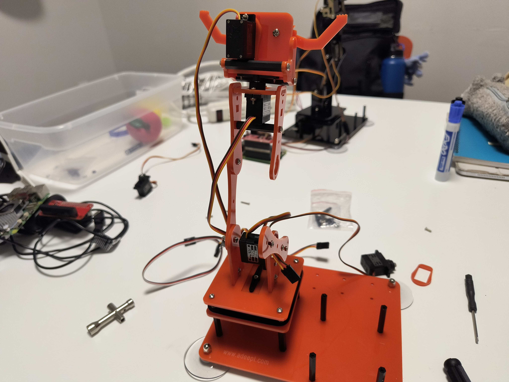
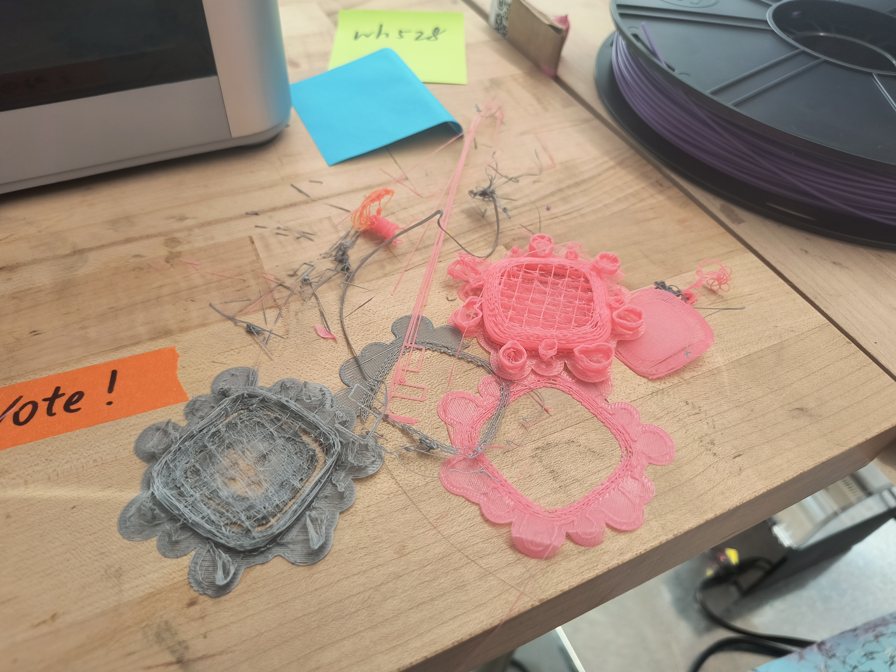

# Brain-Controlled Robot Arm System

**CS-5424 Interactive Device Design - Final Project**

A Brain-Computer Interface (BCI) system that enables hands-free control of dual robot arms using **brain waves (EEG)**, **eye tracking**, and **head position**.

# [Project Plan <-- Links To Slides](https://docs.google.com/presentation/d/1WY4ilFuVzT3Rz_qvewdD0awsA0MkKxgCzuKVUzCQ7ec/edit?usp=sharing)

*Click Below image for video - Our Process*

[](https://youtu.be/bEdHWzW3KOQ)

*Click Below image for video - Final User Tests*

[](https://youtu.be/nCsQuOMSU3k)

---

## Overview

This project creates an accessible human-robot interaction system where users can control robot arm movements without using their hands. The system combines three input modalities:

| Input | Source | Purpose |
|-------|--------|---------|
| **Attention Level** | NeuroSky MindWave EEG Headset | Confirms intent (higher focus = action trigger) |
| **Gaze Position** | Webcam + MediaPipe | Selects which control to activate |
| **Head Position** | Webcam + MediaPipe | Coarse pointing for gaze targeting |

---

## System Architecture

```
┌─────────────────────┐
│  NeuroSky Headset   │──Bluetooth──┐
│  (EEG Brain Waves)  │             │
└─────────────────────┘             │
                                    ▼
┌─────────────────────┐      ┌─────────────────┐      ┌─────────────────┐
│      Webcam         │─────▶│   Main App      │─────▶│  Servo Hat      │
│  (Eye + Head Track) │      │  (servo_app.py) │      │  (PCA9685)      │
└─────────────────────┘      └─────────────────┘      └────────┬────────┘
                                    │                          │
                                    ▼                          ▼
                             ┌─────────────────┐      ┌─────────────────┐
                             │  LED Stick      │      │   Robot Arms    │
                             │  (Attention)    │      │  (10 Servos)    │
                             └─────────────────┘      └─────────────────┘
```

---

## Project Structure

```
CS-5424---Final-Project/
├── servo_gui/                 # Main control application
│   ├── servo_app.py          # Tkinter GUI with full arm control
│   ├── servo_widget.py       # Individual servo +/- control widget
│   ├── preset_widget.py      # Preset pose buttons & toggle
│   ├── headset_input.py      # Threaded NeuroSky client class
│   └── eye_tracker.py        # Threaded eye tracking class
│
├── rsp_game/                  # Demo application
│   └── rsp.py                # Rock-Paper-Scissors game
│
├── pi_headset.py             # Standalone headset data viewer
├── eye_tracking.py           # Standalone eye tracking demo
├── sudodata.py               # Mock headset data generator
│
├── setup_guide.md            # Hardware setup instructions
├── requirements.txt          # Python dependencies
└── README.md                 # This file
```

---

## Components

### 1. NeuroSky Headset Integration

**Files:** `testing_features/pi_headset.py`, `servo_gui/headset_input.py`

Connects to a NeuroSky MindWave headset via Bluetooth RFCOMM and parses the ThinkGear protocol:

| Data Code | Meaning | Range |
|-----------|---------|-------|
| `0x02` | Signal Quality | 0 (best) - 200 |
| `0x04` | **Attention** | 0 - 100 |
| `0x05` | Meditation | 0 - 100 |
| `0x83` | EEG Power Bands | 8 frequency bands |

**Key Insight:** The **Attention** value (0-100) is used as a confirmation mechanism. The system only triggers actions when attention exceeds a threshold (default: 35), ensuring intentional control.

### 2. Eye & Head Tracking

**Files:** `testing_features/eye_tracking.py`, `servo_gui/eye_tracker.py`

Uses MediaPipe Face Mesh to track:
- **Iris position** within each eye (pupil tracking)
- **Head position** via nose tip landmark

The final gaze position combines:
- 40% eye gaze direction
- 60% head position

This hybrid approach is more robust than pure eye tracking while remaining responsive.

### 3. Main Control Application

**File:** `servo_gui/servo_app.py`

A windowed Tkinter application (80% screen size) with multiple control modes:

#### Preset Mode (Default)
- Pre-defined arm poses organized into categories
- Scrollable list with gaze-controlled scroll buttons
- Categories include: **Throw**, **Kick**, **Pass Object (L to R)**
- Each category has its own submenu with step-by-step actions

#### Manual Mode
- Fine-grained control of each servo
- Descriptive labels (e.g., "Forwards/Backwards" instead of "+/-")
- Visual feedback when at joint limits

#### Features
- **Mock Hardware Mode**: `USE_MOCK_HARDWARE = True` for testing without servos
- **LED Attention Meter**: 10-LED strip showing attention level (Red → Yellow → Green)
- **Startup Pose**: Configurable initial arm position
- **Smooth Interpolation**: Servo movements interpolated over time for fluid motion
- **Safe Exit**: Returns to startup pose before shutting down

#### Servo Mapping

| Arm | Joint | Channel | Labels |
|-----|-------|---------|--------|
| Left | Base | 0 | Right / Left |
| Left | Shoulder | 1 | Backwards / Forwards |
| Left | Elbow | 2 | Forwards / Backwards |
| Left | Wrist | 3 | Right / Left |
| Left | Gripper | 4 | Open / Close |
| Right | Base | 15 | Right / Left |
| Right | Shoulder | 14 | Backwards / Forwards |
| Right | Elbow | 13 | Forwards / Backwards |
| Right | Wrist | 12 | Right / Left |
| Right | Gripper | 11 | Open / Close |

#### Servo Limits

Two arm configurations are supported with different servo limits:

| Type | Used For | Shoulder Range | Gripper Range |
|------|----------|----------------|---------------|
| Orange | Left Arm | 10° - 100° | -20° - 73° |
| Black | Right Arm | 20° - 150° | -50° - 50° |

### 4. Rock-Paper-Scissors Demo

**File:** `rsp_game/rsp.py`

A demonstration game showing the system's capabilities:

1. User looks at Rock (R), Paper (P), or Scissors (S)
2. Dwell + focus triggers selection
3. Left arm displays user's choice
4. Right arm displays random computer choice
5. Winner determined and displayed
6. Auto-exits after 10 seconds if user wins

**Servo Gestures:**
| Gesture | Gripper Angle | Description |
|---------|---------------|-------------|
| Rock | 180° | Closed fist |
| Paper | 0° | Open hand |
| Scissors | 90° | Half open |

### 5. LED Attention Meter

**Integrated in:** `servo_gui/servo_app.py`

Uses a Qwiic LED Stick (10 LEDs) to display attention level in real-time:

| LEDs Lit | Attention Level | Color |
|----------|-----------------|-------|
| 1-3 | Low (0-30) | Red |
| 4-6 | Medium (30-60) | Yellow |
| 7-10 | High (60-100) | Green |

Runs a test pattern on startup to verify functionality.

---

## Hardware Requirements

- **Raspberry Pi** (tested on Pi 4)
- **SparkFun Pi Servo Hat** (PCA9685-based)
- **NeuroSky MindWave Mobile** EEG headset
- **USB Webcam** (for eye tracking)
- **2x Robot Arms** with 5 servos each
- **Qwiic LED Stick** (optional, for attention visualization)

---

## Software Dependencies

```bash
pip install -r requirements.txt
```

Key dependencies:
- `mediapipe` - Face mesh and iris detection
- `opencv-python` - Video capture and processing
- `sparkfun-pi-servo-hat` - Servo control
- `qwiic-led-stick` - LED attention meter
- `screeninfo` - Screen dimension detection

**⚠️ IMPORTANT:** Follow the instructions in [`setup_guide.md`](setup_guide.md) to connect the NeuroSky Headset to the Raspberry Pi via Bluetooth.

---

## Usage

### Main Servo Control App
```bash
cd servo_gui
python3 servo_app.py
```

### Rock-Paper-Scissors Game
```bash
cd rsp_game
python3 rsp.py
```

### Standalone Manual Servo Control
```bash
cd testing_features
python3 test_servo.py
```

### Standalone Eye Tracking Demo
```bash
cd testing_features
python3 eye_tracking.py
```

### Standalone Headset Data Viewer
```bash
cd testing_features
python3 pi_headset.py
```

### Mock Headset Data (for testing without hardware)
```bash
cd testing_features
python3 sudodata.py --att_mean 60 --att_var 15 --interval 0.5
```

---

## Controls

| Action | Method |
|--------|--------|
| Select control | Look at it (gaze + head position) |
| Confirm action | Focus/concentrate (attention > 35) |
| Toggle mode | Look at "Switch to Manual/Presets" button |
| Scroll lists | Look at Scroll Up/Down buttons |
| Exit application | Press `ESC` |

---

## Interaction Flow

```
1. LOOK    → Gaze determines which widget is targeted
             (progress bar starts filling)

2. DWELL   → Keep looking for 1.5 seconds
             (progress bar fills up)
             Progress decays if you look away

3. FOCUS   → Concentrate to trigger action
             (attention level must exceed threshold)

4. ACTION  → Servo moves smoothly to target position
             (interpolated over configurable duration)
```

---

## Configuration Options

### Mock Hardware Mode
In `servo_gui/servo_app.py`:
```python
USE_MOCK_HARDWARE = True  # Set to False for real hardware
```

### Startup Pose
```python
STARTUP_POSE = {
    "LeftArm": {"Base": 60, "Shoulder": 30, "Elbow": 70, "Wrist": 55, "Gripper": 0},
    "RightArm": {"Base": 10, "Shoulder": 50, "Elbow": 70, "Wrist": 90, "Gripper": 0}
}
```

### Attention Threshold
```python
THRESHOLD = 35  # Minimum attention level to trigger actions
```

### Dwell Time
```python
dwell_time = 1.5  # Seconds of sustained gaze required
```

---

## Accessibility Features

This system was designed with accessibility in mind:

- **Hands-free operation** - No physical buttons or touch required
- **Adjustable thresholds** - Attention threshold can be tuned per user
- **Fallback controls** - Mouse hover works if eye tracking unavailable
- **Visual feedback** - Progress bars, color changes, and LED meter show system state
- **Progress decay** - Looking away doesn't reset progress immediately
- **Graceful degradation** - Works in simulation mode without hardware
- **Safe shutdown** - Returns arms to known position on exit

---

## Preset Actions

### Main Menu Presets
- Home Position
- Left/Right Gripper Open/Closed
- Left/Right Elbow Bent/Extended
- Wave Animation (single and both arms)
- Reach Forward (Both)
- Pass Object (L to R)

### Category: Throw
1. **Prepare** - Position arm for loading
2. **Load** - Close gripper on object
3. **Launch** - Animated throwing motion with release

### Category: Kick
1. **Load** - Wind up position
2. **Strike** - Animated kick motion

### Category: Pass Object (L to R)
Step-by-step sequence for passing an object between arms with manual fine-tuning controls.

---

## Setup

See `setup_guide.md` for detailed hardware setup instructions including:
- Bluetooth pairing with NeuroSky headset
- Servo hat wiring
- Raspberry Pi configuration

---

## Authors

Benthan Vu (bv233)

Akash Basu

Evan Fang


## Reflection

Overall this was pretty fun! We spent multiple nights working past midnight trying to get everything to work. We all worked pretty equally on this, everyone was asking about what they could do to help, or completing tasks that no one else was doing. For example, I told the team that once I was finishing making some more pose presets for the arms, I would work on adding the light strip to the program. Akash was free, so he was able to work on adding the light strip instead, while I was still working on the presets. One thing I wish I knew at the start was the reason for our power issue. This was one of the main reasons why I'd stay up so late. Trying to figure out why it was happening, and seeing if it would go away. Another thing I wish I knew at the start was keeping in mind that our demo is supposed to be interactive. I spent a bit too much time trying to make a complex passing animation that would play in its entirety in one go. Near the end, I realized that it should probably have more interactivity in it than just triggering one long animation, so I split it into different stages, just like the kick and throw animations. We also ran into a lot of issues and had various success rates in regards to fixing them.

The first issue we had was trying to connect the headset to bluetooth in the first place, to read data from it. Akash was unable to due to his macbook and was unable to figure out how to connect the headset to the pi. He gave me the headset and let me try connecting. After a while, with the help of Gemini, we figured out that we needed to change a bluetooth configuration to connect to it.

Most of out other issues were related to the robotic arms. One issue we ran into when moving the arm's joints was the limit of how much they could rotate. Sometimes if they rotated too much in one direction, they couldn't rotate back.

To fix this, we used a test program to test the limits of each servo and made it so servos would be programatically limited in the code.

Another issue was a power issue where we would sometimes get a warning from our pi that it didnt have enough energy to support all the servos. We tried many solutions with the aid of Google Gemini, such as switching power sources. We tried to used a stronger 90W laptop charger instead of the 27W pi chargers, but that didn't work since it seemed to cause the arms to move erratically. Another thing we tried was power isolation by cutting one of the connections of the pi servo pHAT so that the power drain wouldn't cause the pi to shutdown. Instead, it just made the arms weaker, so we assumed the servos needed both power sources. We even did power isolation with the laptop charger, but it still had the issue of erratic arm movements. Gemini said that was because the laptop charger, even though it has higher watts, has something called "dirty power" related to charging laptops.


We were unable to find a fix for this in time for the final demo, but we noticed that this power issue only happened like an hour after we first start using the program. So for the final demo we didn't start the program until we had a tester ready. But surprisingly, during the demo, the power issue never happened. And after a bunch of thinking, I realize the issue may be because I was using an LLM running directly on the pi to help with coding, since I was using SSH to work on code. This LLM would then overheat the pi, causing more power usage. And that would be why the issue never happened during our demos, because we wouldn't be coding and therefore the LLM wouldn't be active.

We also ran into issues with the arms. Sometimes they would become jittery. We were able to fix this by isolating the faulty servo and replacing it.



I also wanted to 3D print a stand that our arms could pick up objects from. Unfortunately the 3D printer didn't seem to work, and I had multiple failed prints.

Eventually I got it to print a mini table that we could place an object on, but in the end we didn't even use it in the final demo.

There were also some quality of life things we added to the UI after noticing issues that users had when trying out our program. We had a button to toggle between manual control and presets on the top right originally, but after noticing that it may be too diffcult to reach easily with the eye tracking, we moved it to the center. During manual control, we also saw that users would sometimes stay on one button, thinking that they were controlling a servo, but in reality it had already reached its max angle. So we changed the buttons so that they stop highlighting when the servo is maxed, to show the user that the button isn't active anymore. We also made the control window only 80% of the screen size because if it was full screen, sometimes people could get distracted and look away, and the eye tracking cursor would get stuck on the edge of the screen on top of a button, and accidentally trigger it. We also saw that users were having an issue staying on the buttons, so we made them bigger, as well as making it so that staring would build up progress, which would decay over time when looking away instead of immediately resetting to zero.

Overall, we have learned a lot. I have learned more hardware things than I have even known, since I had only been doing software before this class. This has inspired me to try building another hardware device outside of class that uses a mini camera connected to an LLM.
